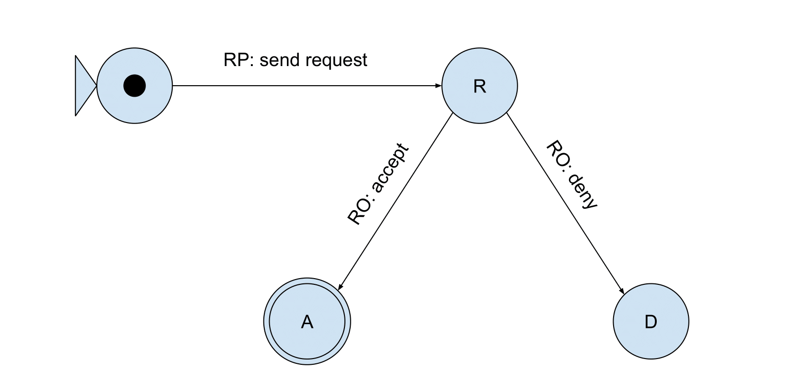

# Access Request Management

This document describes the *access request administration endpoint*.
It contains the methods to describe how to create, read, update and delete access requests.
Example cURL-requests are provided for ease of use.

The general flow of access requests and grants looks like this:



The document makes use of these parties and identifiers:

- **Resource Owner**: `https://pod.harrypodder.org/profile/card#me`
- **Authorization Server**: `http://localhost:4000`
- **Resource Server**: `http://localhost:3000/resources`
- **Requesting Party**: `https://example.pod.knows.idlab.ugent.be/profile/card#me`

The examples provided below make use of `text/turtle` and `application/sparql-update` messages.
The access request used in the examples below looks like this:

```turtle
@prefix sotw: <https://w3id.org/force/sotw#> .
@prefix odrl: <http://www.w3.org/ns/odrl/2/> .
@prefix dcterms: <http://purl.org/dc/terms/> .
@prefix dct: <http://purl.org/dc/terms/> .
@prefix ex: <http://example.org/> .
@prefix xsd: <http://www.w3.org/2001/XMLSchema#> .

ex:request a sotw:EvaluationRequest ;
      sotw:requestedTarget <http://localhost:3000/resources/resource.txt> ;
      sotw:requestedAction odrl:read ;
      sotw:requestingParty <https://example.pod.knows.idlab.ugent.be/profile/card#me> ;
      ex:requestStatus ex:requested ;
      odrl:uid ex:request.
```

## Supported endpoints

The current implementation supports the following requests to the `uma/requests` and `/uma/requests/:id` endpoints

- [**GET**](#reading-access-requests)
- [**POST**](#creating-access-requests)
- [**PATCH**](#managing-access-requests)
- [**DELETE**](#deleting-access-requests)

## Creating access requests

Create an access request/multiple access requests by sending a **POST** request to `uma/requests`.
Apart from its `Authorization` header, the `Content-Type` header must be set to the RDF serialization format in which the body is written.
The accepted formats are those accepted by the [N3 Parser](https://github.com/rdfjs/N3.js/?tab=readme-ov-file#parsing), represented by the following content types:

- `text/turtle`
- `application/trig`
- `application/n-triples`
- `application/n-quads`
- `text/n3`

The body is expected to represent a valid ODRL access request.
No sanitization is currently applied.
Upon success, the server responds with **status code 201**.
Bad requests, possibly due to improper access request definition, will respond with **status code 400** (to be implemented) <!-- TODO: implement -->
When the access requested has been validated (to be implemented), but the storage fails, the response will have **status code 500**.

### Example POST request

This example creates an access request `ex:request` for the RP `https://example.pod.knows.idlab.ugent.be/profile/card#me`:

```shell-session
curl --location 'http://localhost:4000/uma/requests' \
--header 'Authorization: https://example.pod.knows.idlab.ugent.be/profile/card#me' \
--header 'Content-Type: text/turtle' \
--data-raw '
@prefix sotw: <https://w3id.org/force/sotw#> .
@prefix odrl: <https://www.w3.org/ns/odrl/2/> .
@prefix dcterms: <https://purl.org/dc/terms/> .
@prefix dct: <https://purl.org/dc/terms/> .
@prefix ex: <https://example.org/> .
@prefix xsd: <https://www.w3.org/2001/XMLSchema#> .

ex:request a sotw:EvaluationRequest ;
      dcterms:issued "2025-08-21T11:24:34.999Z"^^xsd:datetime ;
      sotw:requestedTarget <http://localhost:3000/resources/resource.txt> ;
      sotw:requestedAction odrl:read ;
      sotw:requestingParty <https://example.pod.knows.idlab.ugent.be/profile/card#me> ;
      ex:requestStatus ex:requested .
      odrl:uid ex:request;
'
```

## Reading access requests

To read policies, a single endpoint is currently implemented.
This endpoint currently returns the list of access requests where the WebID provided in the `Authorization` header is marked as the requesting party.
An example request to this endpoint is:

```shell-session
curl -X GET --location 'http://localhost:4000/uma/requests' \
--header 'Authorization: https://example.pod.knows.idlab.ugent.be/profile/card#me'
```

## Managing access requests

The RO can accept or deny the access requests, which is done by updating the status triple.

Updating policies can be done through a **PATCH** request.
The body must hold the content type `application/json`.
The example below shows how to update the access request's status from `requested` to `accepted`:

```shell-session
curl -X PATCH --location 'http://localhost:4000/uma/rquests/:id' \
--header 'Authorization: https://example.pod.knows.idlab.ugent.be/profile/card#me' \
--header 'Content-Type: application/json' \
--data-raw '{ "status": "accepted" }' # can be changed to `denied` too.
```

Once an access request's status has been changed from `requested` to `accepted`, the backend will automatically create a new policy including the correct rules to allow the RP access to the resource.
After this, the RP will be able to use the resource following the UMA protocol.

## Deleting access requests

By making a simple **DELETE** request on the `/uma/requests/:id` endpoint, an access request can be deleted.
The id should be sufficiently encoded in the URL.

```shell-session
curl -X DELETE --location 'http://localhost:4000/uma/requests/:id' \
--header 'Authorization: https://example.pod.knows.idlab.ugent.be/profile/card#me' \
```

## Important Notes

### Undefined behavior for **PATCH/DELETE** request

Upon the first **PATCH** request which changes an access request's status from `requested` to `accepted` a new policy and permission are created.
When a new **PATCH** request would change the status to denied, nothing is currently done with the policy.
Even when the access request would be deleted, the backend currently doesn't do anything to the policy.
This is undefined behavior and should be treated as such.
This works in both directions: if the policy is changed in some way, nothing is changed to the access request either.

## Future work

### Discrepancies between [earlier descriptions](https://github.com/bramcomyn/loama/blob/feat/odrl/documentation/access_grants_vs_dsnp.md) and this implementation

This file counts as authorative resource for the access request management.
Other documentation should point to this file as the latest and correct documentation.
